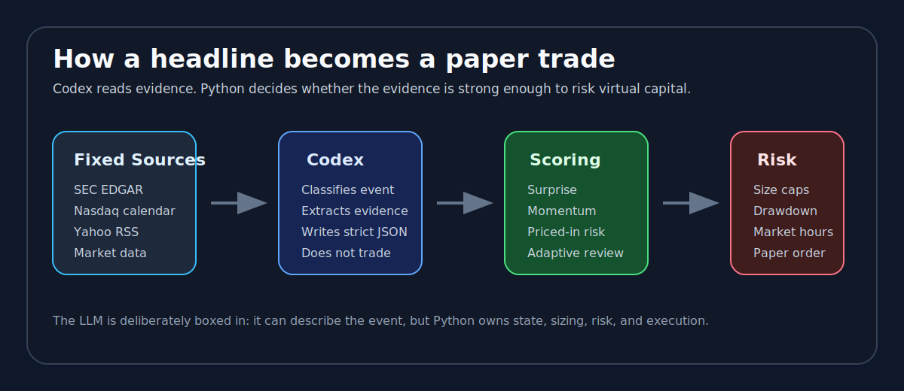
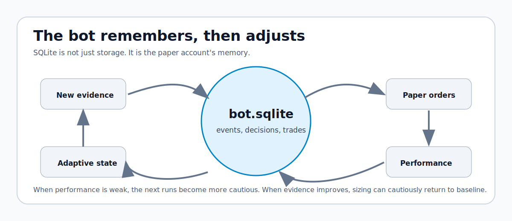

<p align="center">
  
</p>

# Codex Event Trader

An experiment in event-driven paper trading: a small virtual portfolio that watches public market signals, asks Codex to classify what happened, and then lets deterministic Python code decide whether the evidence is strong enough to buy, sell, short, cover, or simply stay still.

This is not a get-rich-quick trading robot. It is closer to a research notebook with a pulse. It wakes up, reads the market's public clues, remembers what it has already seen, writes down what it thinks, and slowly learns whether those thoughts were useful.

> Paper trading only. No real-money trading is enabled.

---

## The Idea

Most retail trading bots start from price charts. This one starts from **events**.

A company files something with the SEC. An earnings date appears. A headline says a business is under legal pressure. An analyst raises a target. A stock has already run up before a known catalyst. The market is not only a chart; it is a stream of public information, expectations, surprises, and reactions.

Codex Event Trader tries to answer one question every time it runs:

**Is this new public information important enough, surprising enough, and clean enough to justify a small paper trade?**

Most of the time the answer is no. That is intentional. The system is designed to avoid trading just because something appeared in a feed.

---

## What It Watches

The bot does not let the LLM wander around the internet. The source plan is fixed in `config/source_registry.toml`, and every run walks that plan in order.

| Layer | What it contributes | Why it matters |
| --- | --- | --- |
| SEC EDGAR | Official filings such as 8-K, 10-Q, 10-K, proxy filings, insider forms | Highest-trust public company disclosures |
| Nasdaq earnings calendar | Upcoming earnings awareness | Helps avoid blindly buying into already-priced expectations |
| Yahoo Finance RSS | Fresh ticker-level headlines | Broad market/news awareness, but noisy |
| Market data | Latest prices, momentum, volume, SPY/QQQ-relative moves | Tells whether the market has already reacted |

The first portfolio universe is deliberately small: large, liquid U.S.-listed names such as NVIDIA, Apple, Microsoft, Alphabet, Amazon, Broadcom, Meta, Tesla, Berkshire Hathaway, and JPMorgan.

---

## How A Run Feels

Each cycle is a conversation between three parts:

1. **The collectors**
   Python tools fetch the same sources every time. They do not improvise.

2. **Codex**
   Codex reads only the pending evidence file and classifies each new event into a strict JSON shape. Codex does not trade.

3. **The trading engine**
   Python scores the event, checks risk, checks market hours, updates memory, and executes only local paper trades.

<p align="center">
  
</p>

---

## The Classifier Is Boxed In

Codex is not allowed to decide sources, browse, size positions, or place trades. Its job is narrow: classify one already-collected item.

The expected shape is:

```json
{
  "ticker": "AAPL",
  "event_type": "earnings",
  "summary": "Short evidence-based summary.",
  "source_reliability": "medium",
  "market_relevance": 50,
  "directional_bias": "unclear",
  "confidence": 0.5,
  "requires_human_review": true,
  "evidence": ["short source-text evidence"]
}
```

That JSON is normalized and bounded before it can affect anything. If Codex is enthusiastic but the scoring layer disagrees, nothing happens. If the market is closed, nothing trades. If confidence is too low, nothing trades. If exposure is too high, nothing trades.

The important design choice is this:

**Codex interprets. Python decides. SQLite remembers.**

---

## What The Bot Trades On

The bot does not trade on one raw headline. It builds a small mosaic.

### Source Reliability

An SEC filing is treated very differently from a noisy RSS headline. A company filing or confirmed calendar event starts with more weight than a broad market article.

### Event Type

Some events are naturally more important:

- earnings
- guidance
- legal/regulatory pressure
- analyst changes
- mergers and acquisitions
- capital returns
- product or AI infrastructure announcements
- macro headlines

### Surprise

The bot asks whether the event sounds better or worse than expectations, not merely whether it sounds good or bad. A company can report good numbers and still fall if investors expected perfection.

### Priced-In Risk

If a stock has already run hard before a known event, the bot becomes more cautious. This is meant to avoid the classic mistake of buying the story after everyone else already bought the expectation.

### Price And Volume Confirmation

The bot checks whether the stock's latest move agrees with the event direction and whether volume looks elevated. Price reaction is not treated as truth, but it is treated as evidence.

### Post-Earnings Follow-Through

For earnings and guidance events, the system gives some attention to the idea that markets can underreact at first and drift afterward. This is handled cautiously and only as one part of the score.

### Adaptive Review

The bot reviews its own results. Weak performance makes it more conservative. Enough positive realized evidence can cautiously let sizing return toward baseline.

---

## The Memory Loop

The bot keeps state in `data/bot.sqlite`. That database records:

- events already seen
- Codex classifications
- signals and trade decisions
- paper trades
- open positions
- cash and equity
- source-run logs
- portfolio snapshots
- performance reviews
- adaptive strategy settings

That memory prevents duplicate trading. If the same filing or headline appears again, the database knows it has already been seen.

<p align="center">
  
</p>

---

## The Portfolio

The starting portfolio is virtual:

```text
Starting cash: $1,000
Broker: local paper simulator
Real-money trading: disabled
Options: disabled
Margin: not connected to a real broker
Short simulation: enabled with exposure controls
```

Shorts are represented as negative share quantities. Equity is marked as:

```text
cash + quantity * latest_price
```

The report compares the portfolio against SPY and QQQ from the bot's starting point, so the experiment is not judged in isolation. If the bot returns 1 percent while QQQ returns 4 percent, that matters.

---

## Risk Controls

The bot has several ways to say no:

- trade only during regular U.S. market hours
- skip weak confidence events
- cap position size
- cap gross exposure
- stop tightening after drawdown
- avoid duplicate events
- prefer hold when the source is noisy
- require valid market prices
- run performance review after execution

The system is intentionally biased toward not trading unless the evidence clears several gates.

---

## Automation

The project is designed to run from Codex on a local laptop.

The automation flow is:

```text
market_status
if market is open:
  codex_collect
  Codex writes codex_classifications.json
  codex_execute
  review
  report
else:
  review
  report
```

The current Codex automation is hourly because the earlier half-hour schedule was not interpreted correctly by the Codex scheduler. The script itself still gates real paper execution by U.S. market hours.

---

## Current Research Posture

This is a 30-day paper experiment, not a finished trading strategy.

The current system is good at:

- fixed source collection
- duplicate prevention
- Codex classification handoff
- deterministic scoring
- risk-gated paper execution
- portfolio memory
- adaptive performance review
- transparent reports

The next serious improvements are:

- richer exit logic
- proper U.S. exchange holiday calendar
- stricter relevance filtering for noisy RSS feeds
- deeper attribution by source, event type, confidence bucket, and ticker
- alerts when a trade happens or a source fails repeatedly
- more tests around market-closed behavior and short risk

---

## Visual References

The README uses market imagery from Wikimedia Commons:

- Trading Floor at the New York Stock Exchange, Scott Beale, CC BY-SA 4.0: https://commons.wikimedia.org/wiki/File:Trading_Floor_at_the_New_York_Stock_Exchange.jpg
- Nasdaq MarketSite, Ajay Suresh, CC BY 2.0: https://commons.wikimedia.org/wiki/File:Nasdaq_MarketSite_(51494550508).jpg

<p align="center">
  
</p>

---

## Disclaimer

This repository is for research and education. It is not financial advice, not an investment recommendation, and not a real-money trading system. The broker is local paper simulation unless you deliberately replace it with something else.

